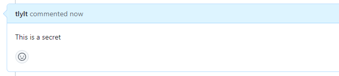
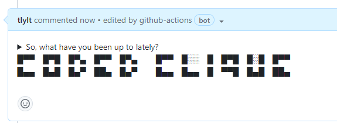

# Coded Clique

[](https://github.com/tlylt/coded-clique/actions/workflows/test.yml)

This action provides the following functionality for GitHub Actions users:

- Hide your issue/comment content from the prying eyes of a casual visitor

Before:



After:




# Usage

You may use the action without any additional parameters.

```yaml
steps:
- uses: tlylt/coded-clique@v1
```

### Action inputs

| Name       | Description                                                                                        | Default        |
|------------|----------------------------------------------------------------------------------------------------|----------------|
| `token`    | `GITHUB_TOKEN` (`issues: write`, `pull-requests: write`) or a `repo` scoped personal-access-token. | `GITHUB_TOKEN` |
| `encoding` | The encoding method to use: "base64" or "question".                                                | `base64`       |

For  `GITHUB_TOKEN`, go to your repository's Settings > Actions > General, under "Workflows permissions", select "Read and write permissions" and save. With that, you can simply use `token: ${{ secrets.GITHUB_TOKEN }}`.

# Testing

```yaml
name: Test coded-clique

on:
  issues:
    types: [opened, edited]
  issue_comment:
    types: [created, edited]

jobs:
  build:
    runs-on: ubuntu-latest
    name: test
    steps:
      - name: Coded Clique
        uses: tlylt/coded-clique@main
        with:
          token: ${{ secrets.GITHUB_TOKEN }}
```

# Development

Updates will be done on the main branch. When ready, tag and release according to semver.

# License

The scripts and documentation in this project are released under the [MIT License](LICENSE)
